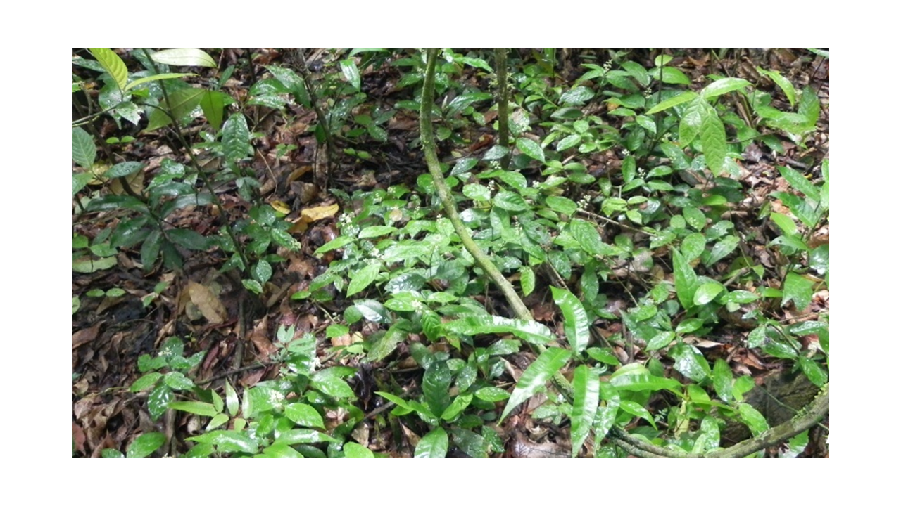
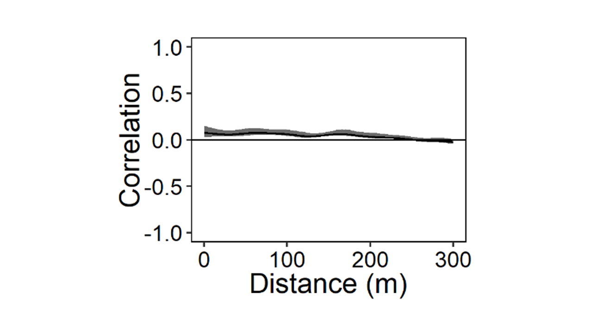
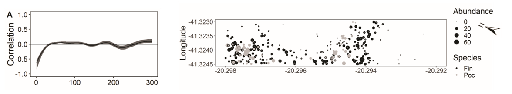

<h1 align="center">Is there a species swarm paradox? Spatial segregation of related species in the understory of a tropical plant community </h1>

 
 

*The image represents an aggregate of Rubiaceae species in the understory of a tropical forest.* 

This is an article written during my master's studies (2017-2019). The article was accepted in the Journal of Vegetation Science. [To access the paper](https://onlinelibrary.wiley.com/doi/abs/10.1111/jvs.13172).

# 1. Study problem
Individual plants of some highly diverse angiosperm families occur in aggregated spatial patterns in tropical plant communities, which have been defined as species swarms. While this spatial aggregation seems paradoxical, since related species should segregate in space due to expected ecological similarities, it has yet to be tested. We assessed whether species of the family Rubiaceae segregate in space in the understory of a tropical plant community.

# 2. Data description
Data for this study can be found on the [Zenodo platform](https://zenodo.org/record/7463111#.Y62dfBXMLIU). 

# 3. Methods
We surveyed all local aggregates of Rubiaceae species within an 18.75 ha plot across a topographic gradient. Based on the species abundance distribution, we used the 10 most abundant species to model their spatial patterns using univariate and bivariate spline spatial correlations. Bubble graphs were used to show how these species were distributed across the gradient. 

# 4. Insights 
Our study site comprises topographically heterogeneous terrain with a valley, a slope, and a ridge, typical of the Brazilian Atlantic Forest (Hollunder et al., 2021). We assessed whether the species segregate in space and tested the hypothesis that the most abundant species (those with more than 80% of total abundance) are: 

### **Hypothesis 1.** Patchily distributed in space

  

### **Hypothesis 2.** Segregated among each other in space (i.e., they do not co-occur in space).

  

Results: A total of 12,258 individuals of 47 species were found distributed in 543 local aggregates. The 10 studied species corresponded to 86% of the total abundance and were aggregated in space, at distances from zero up to 10–300 m. Pairwise comparisons revealed a segregation pattern at scales ranging from zero up to 10–230 m. Local aggregates were strongly dominated by a single species, while many other species occurred at very low abundances.

# 5. Conclusion
The studied species of Rubiaceae shared the understory environment by occupying different portions of available space. Habitat preferences, negative interactions, dispersal limitation, and priority effects may explain the observed spatial patterns. Swarms are not paradoxical as species of Rubiaceae use different microhabitats within the forest understory.

# 6. Next steps
Future studies should address how phylogenetic proximity associated with functional attributes of species of Rubiaceae can influence community assembly patterns. Niche conservatism of plant traits needs to be assessed with the knowledge of kinship patterns within the family Rubiaceae, given its great species richness within the understory of tropical forests. This would help determine whether the spatial patterns found here depend on ancestral traits maintained along evolutionary lineages. 

------------
# Contato
 

[e-mail](karinnasantos0@gmail.com)

[Portifólio de projetos](https://karinnasantos.github.io/project_portfolio/)

[Medium](https://medium.com/@karinnasantos0)